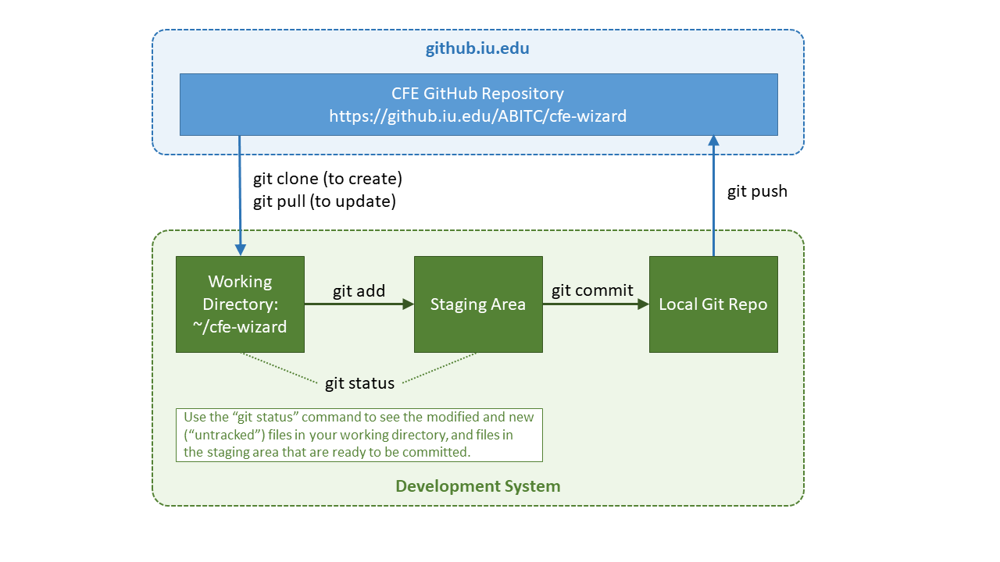

CFE Wizard Developers Guide
============================================

CFE Wizard Technical Information
---------------------------------------

The CFE Wizard is a Java web application, which
uses the following technologies:

* [Struts 2](https://struts.apache.org/) is the web application framework used.
* [Hibernate](https://hibernate.org/) is used for the persistence framework.
* [Maven](https://maven.apache.org/) is used for the build process, including dependency management.
* [Flyway](https://flywaydb.org/) is used to handle database migrations.
* [R](https://www.r-project.org/) is used as a scripting language; R scripts are executed from Java.

For information on setting up a development environment (with Ubuntu examples),
see [Development Environment Setup](./DevelopmentEnvironmentSetup.md)

Checking for out of date dependencies
---------------------------------------

To check for out of date dependencies, run the following command in the
top-level directory of your project:

    mvn versions:display-dependency-updates

Building the CFE Wizard
--------------------------

To build run the following command in the top-level directory:

    mvn -X clean package

This will create the web archive file **target/CFE.war**

Installing the CFE Wizard on a New Server
---------------------------------------------

You need to have the following software installed on the server:

* Java - the CFE Wizard runs successfully using Java 1.8
* Tomcat - or a similar web application server
* MySQL - version 5.7 has been successfully used

### Database Setup

A database and database user need to be set up for the CFE Wizard in the MySQL database. For example,
the following commands could be used within MySQL:

    CREATE DATABASE cfe;
    CREATE USER 'cfeUser'@'localhost' IDENTIFIED BY 'cfePassword';
    GRANT ALL ON `cfe`.* TO 'cfeUser'@'localhost';

Note that Flyway will take care of setting up the database tables needed by the CFE Wizard when it
is run for the first time on a new server.

### CFE Properties File Setup

You need to create a CFE properties file, named **.cfe.properties** in the home directory of the account that Tomcat runs
under, e.g., /home/tomcat/. This is a template for this file showing what properties need to be set:

    # Database and Hibernate
    db.username=cfeUser
    db.password=cfePassword
    db.host=jdbc:mysql://localhost:3306/cfe?serverTimezone=UTC
    db.hbm2ddl=validate

    # Set this to true, if https is being used
    secure.cookies=

    # CFE user accounts. The "user" account has limited privileges (e.g., it cannot upload databases)
    user.username=user
    user.password=cfe
    admin.username=admin
    admin.password=cfe

Note that the **serverTimezone** argument in the **db.host** property is needed to get the system to work.
If it is removed, the application will fail to start, and an error message will be printed to the
Tomcat log file.

### CFE Wizard Installation/Update
After the properties file has been created, to install the CFE Wizard on a new server, copy the
**CFE.war** file (see above) to the **webapps/** directory of Tomcat. This step is also what needs
to be done to update the CFE Wizard. Tomcat should automatically install the WAR (Web ARchive) file
after it has been copied to the webapps directory.

### Making a New Release

The VERSION_NUMBER in the following file should be updated for the new release:

    src/main/java/cfe/model/VersionNumber.java

Then a tag should be created that has the same name as the VERSION_NUMBER value, for example:

    git tag -a 1.2.3 -m 'Put a comment here summarizing the changes for this tag'
    git pusn origin 1.2.3

Then a release should be created in GitHub with the name "CFE Wizard _release-number_", and
with a description of the major changes for this release.

Code Directory Structure
---------------------------------------------------------------------

* **sql/** - scripts for creating the CFE database and CFE database user
* **src/** - source code
    * **main/** - application source code
        * **java/** - Java source code
        * **resources/**
            * **python/** - Python script(s)
            * **R/** - R scripts
        * **webapp/**
            * **css/** - CSS (Cascading Style Sheets) for the web pages
            * **images/** - images for the web pages
            * **js/** - JavaScript files for the web pages
            * **pages/** - the JSP (Java Server Pages) web pages
    * **test/** - tests source code
* **target/** - directory where generated WAR (Web ARchive) file (CFE.war), and asscoiated files, are stored
* pom.xml - Maven comfiguration file (contains library dependency information)

GitHub Workflow
---------------------------------------

The CFE Wizard code is stored in an IU GitHub repository. This repository needs to be cloned to your personal
computer, and changes made there. Once changes are complete, they can be pushed to the IU GitHub repository.
In general, development is done on the **develop** branch, or a branch off of the develop branch.
When a new version is complete, the branch it was developed on is merged with the **master** branch, and
the version is numbered and tagged (see above).

